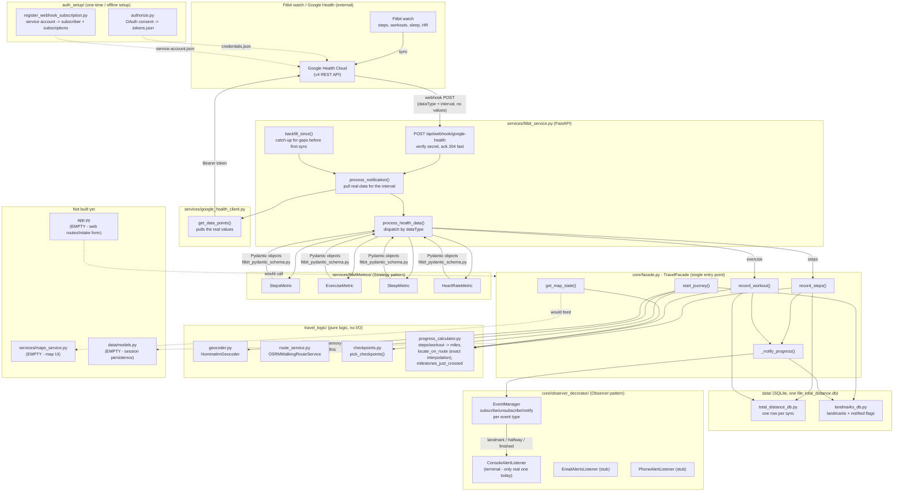

# Day 4 — Exact positioning, workout pace, observer pattern, going live

Full blow-by-blow (every prompt + reasoning) is in `docs/prompt_log/`:
`2026-09-08-progress-calculator-position-interpolation.md`,
`2026-09-08-workout-pace-activity-tracking.md`,
`2026-09-08-observer-pattern-notifications.md`,
`2026-09-08-live-run-and-backfill.md`. This is the condensed version for
picking work back up.

## TL;DR
Took the "walk the world" pipeline from day3's manually-seeded smoke test
to something that actually runs against real Fitbit/Google Health data:
fixed the map position to be an exact point on the real path (not a
snap-to-nearest-waypoint guess), taught workouts to move you with a real
measured pace instead of one flat stride constant (running ≠ walking),
rebuilt notifications on a textbook Observer pattern, added a historical
backfill path for data older than the webhook ever saw, and fixed a real
broken-auth bug hit while actually trying to go live. Test suite grew from
24 to **77**, all passing.

## What we did today
1. **`locate_on_route` now interpolates, doesn't snap.** OSRM's route
   points are real vertices placed exactly where the path's direction
   changes - a straight line between two consecutive ones *is* the real
   path there, not an approximation of it. So finding the exact point at
   a given mileage (arc-length placement) is deterministic math, not a
   guess - unlike Google Maps' live-nav problem (noisy GPS, ambiguous
   road-matching), which is a genuinely different, harder problem we don't
   have. Added a guard for an empty route (`ValueError`, matching
   `RouteService`'s own contract) instead of crashing with `IndexError`.
2. **Wrote the first tests for `travel_logic/progress_calculator.py`** -
   zero before today, despite it being pure math with no network calls.
3. **Workout pace now feeds distance, differentiated by activity type.**
   `ExerciseMetricsSummary` gained the real `averageSpeedMillimetersPerSecond`/
   `averagePaceSecondsPerMeter` fields (confirmed against Google's actual
   API reference before adding them, not guessed). Distance priority per
   workout: real measured distance > device-reported pace × duration >
   steps × a calibrated-or-default *per-activity-type* stride (running
   covers more ground per step than walking) > a calibrated per-type pace
   as a last resort. Non-foot activities (biking, swimming) never count
   toward progress - explicit user call. Fixed a real double-counting bug
   two different ways: distance from an already-credited workout's window
   doesn't get re-added by a duplicate `"steps"` event, and (caught by a
   test asserting the exact step count) neither does its *step count*.
4. **Notifications rebuilt as a real Observer pattern**, matching
   https://refactoring.guru/design-patterns/observer's structure exactly:
   `EventManager` (Publisher infra, subscribers keyed by event type) +
   generic `EventListener.update(data)`, replacing the old
   landmark-only-shaped `LandmarkEvents`. `TravelFacade` plays the
   Publisher role (`self.events`), now firing three event types -
   `"landmark"`, `"halfway"` (50%), `"finished"` (reached the destination,
   includes total steps) - to one terminal listener for now (web-app
   delivery designed but explicitly deferred this pass).
5. **Went live** - verified `credentials.json`/`.tokens.json`/
   `service-account.json`/ngrok were all already in place, and that the
   plaintext-secret concern flagged back on day 2/3 was already resolved
   (everything sensitive is gitignored and untracked).
6. **Added `backfill_since()`** for data older than the webhook ever saw -
   e.g. a journey started days before the watch's first real sync. Reuses
   `process_notification` as-is (no second pull/dispatch path) - this is
   the "future batch-pull component" flagged all the way back in day1's
   very first prompt log entry, built now because it's actually needed.
7. **Hit and fixed a real broken-auth bug**: `.tokens.json` had no
   `refresh_token` at all, because `build_auth_url()` didn't force
   `prompt=consent` - Google only issues a refresh_token on a user's
   *first* consent grant, silently omitting it on repeats. Fixed the
   root cause and replaced a `KeyError` traceback with a clear error.
8. **Hit and worked around the in-memory-session-is-per-process gotcha**:
   seeding a journey in a separate REPL process doesn't reach a
   separately-running server process - `TravelFacade._sessions` lives in
   whatever process created it. Solved with a one-off combined seed+serve
   script rather than adding new debug endpoints (simpler, and this
   whole problem goes away once `data/models.py` gives sessions real
   persistence). Script was temporary and has been deleted.

## Big moments / realizations
- **The interpolation fix isn't a "good enough" approximation - it's the
  exact answer**, and figuring out *why* (a polyline's straight segments
  between direction-change vertices literally *are* the real path there)
  was the single clearest "aha" of the day. It also cleanly separated two
  problems that kept getting conflated: Google Maps' live-GPS map-matching
  (genuine probabilistic guesswork) vs. our arc-length placement on an
  already-fully-known path (deterministic).
- **Rejecting spline/Natural-Neighbor interpolation** was a useful
  near-miss: those are the right tools for a *different* shape of problem
  (estimating a value at a scattered point in open 2D space, like terrain
  elevation from sparse samples) - applying them here would have made
  position *less* accurate by inventing curvature that isn't there.
- **Verifying the real API before coding, instead of guessing a field
  name.** Fetched Google's actual REST reference and found
  `averageSpeedMillimetersPerSecond`/`averagePaceSecondsPerMeter` really
  exist - avoided both under-building (assuming no pace field exists) and
  a silent schema mismatch (guessing a wrong field name).
- **A test catching a real bug in the same session it was written.** The
  double-count fix for *distance* accidentally left the *step count*
  double-counted (`today_steps()` came back 8400 instead of 4200) - caught
  immediately because the test asserted the exact number instead of just
  "some number changed."
- **The in-memory-session gotcha only became visible by actually trying
  to go live.** Every prior "how to run it" step worked fine in isolation
  (tests, REPL smoke tests) - it took wiring up the real uvicorn + ngrok +
  webhook loop to expose that seeding and serving have to happen in the
  same OS process.

## Decisions made along the way (flagged to the user, not silent)
- Renamed `LandmarkEvents` → `EventManager` + generalized `EventListener`'s
  payload, once a second and third event type made the old landmark-only
  shape actively misleading - matches the "no eventType routing - YAGNI
  until a second event type exists" comment already sitting in that file.
- Halfway/finished tracked as an in-memory `set` on the session, not a
  new DB table or synthetic `route_landmarks` rows - they're percent
  thresholds, not real places on the map, so reusing the landmarks table
  would've meant a schema migration for something a two-line check handles.
- No live extrapolation of position into time between syncs - every event
  we get describes an interval already over; projecting forward would
  repeat the guessed-6000-steps/day ETA mistake already fixed once.
  Flagged as a legitimate but separate feature if ever wanted.
- Web-app notification delivery (a `WebAppAlertListener` + polling
  endpoint) was fully designed but explicitly shelved this pass in favor
  of terminal-only, per direct instruction.
- No pagination handling added to `get_data_points`/`backfill_since` -
  fine for the few-day gaps this is built for; would be guessing at
  Google's real pagination shape without confirming it first.

## Files created
- `tests/test_progress_calculator.py`, `tests/test_facade.py`,
  `tests/test_event_manager.py`
- `core/observer_decorator/event_manager.py`
- `docs/prompt_log/2026-09-08-progress-calculator-position-interpolation.md`,
  `docs/prompt_log/2026-09-08-workout-pace-activity-tracking.md`,
  `docs/prompt_log/2026-09-08-observer-pattern-notifications.md`,
  `docs/prompt_log/2026-09-08-live-run-and-backfill.md`

## Files modified
- `travel_logic/progress_calculator.py` - interpolation, empty-route
  guard, workout distance/calibration functions, `milestones_just_crossed`
- `core/facade.py` - `record_workout`, steps/workout double-count guard,
  observer wiring (`self.events`), shared `_notify_progress`, new session
  fields (`stride_by_type`, `pace_by_type_mph`, `workout_intervals`,
  `destination`, `milestones_notified`)
- `services/fitbit_pydantic_schema.py` - `ExerciseMetricsSummary` gained
  `average_speed_mm_per_s`/`average_pace_s_per_m`
- `services/fitbit_service.py` - `"exercise"` case wired to
  `record_workout`, `"steps"` case passes its interval, `backfill_since()`
- `core/observer_decorator/event_listener.py` - generic `update(data)`
- `core/observer_decorator/console_alert_listener.py` - generic printer
- `auth_setup/google_health_auth.py` - `prompt=consent`, clear
  `RuntimeError` instead of a `KeyError` on a missing refresh_token
- `tests/test_fitbit_service.py` - backfill tests

## Files deleted
- `core/observer_decorator/events.py` (replaced by `event_manager.py`)
- `run_live.py` (temporary seed+serve launcher, created and removed same
  day once its job - proving out the run - was done)

## Test result
`venv/bin/python3 -m pytest -q` → **77 passed** (started the day at 24).

## How to run it
See `docs/prompt_log/2026-09-08-live-run-and-backfill.md` for the full
runbook including the auth fix. Short version:
```bash
venv/bin/python3 -m pip install -q -r requirements.txt
venv/bin/python3 auth_setup/authorize.py   # only if .tokens.json's refresh_token is missing/broken
```
Then, in order: Terminal 1 `uvicorn services.fitbit_service:app --reload`,
Terminal 2 `ngrok http 8000`, Terminal 3
`register_webhook_subscription.py <ngrok-url> 580356155767`. **Remember**:
seeding a journey (`travel_facade.start_journey(...)`) has to happen in
the *same process* as the running server - a separate REPL won't reach
it. `run_live.py` did this by seeding then calling `uvicorn.run(...)`
in-process; recreate that pattern (or wait for `app.py`) next time.

## Open items / next session
- **`app.py` is still empty** - still the single biggest remaining piece,
  flagged every day since day3.
- **`TravelFacade._sessions` is still in-memory only** - today's
  in-memory-session-is-per-process gotcha is a symptom of this same
  long-open gap (`data/models.py`), not a new problem.
- **No real live end-to-end sync was completed today** - we got the
  runbook and the seed/serve process worked out, but a real journey with
  real from/to/gender was never actually seeded and watched through a
  real Fitbit sync. Next session's most direct next step.
- No pagination handling in `get_data_points`/`backfill_since`.
- Email/phone listeners still stubbed, not wired.
- Web-app notification delivery (design exists, not built) - terminal-only
  for now, by choice.
- `stride_length_m` from the Google Health profile still unconfirmed
  available via the real API (needs a live `get_profile()` probe).
- `FOOT_EXERCISE_TYPES` is the on-foot subset found via one documentation
  fetch, not exhaustively cross-checked against the full 200+-value enum.
- No live confirmation yet that `averageSpeedMillimetersPerSecond`/
  `averagePaceSecondsPerMeter` are actually populated by a real device.
- `services/maps_service.py` is still empty - the actual map UI.

## Architecture so far



Solid arrows are real, working data flow today; dotted arrows are either
setup-time (not per-request) or not built yet.
